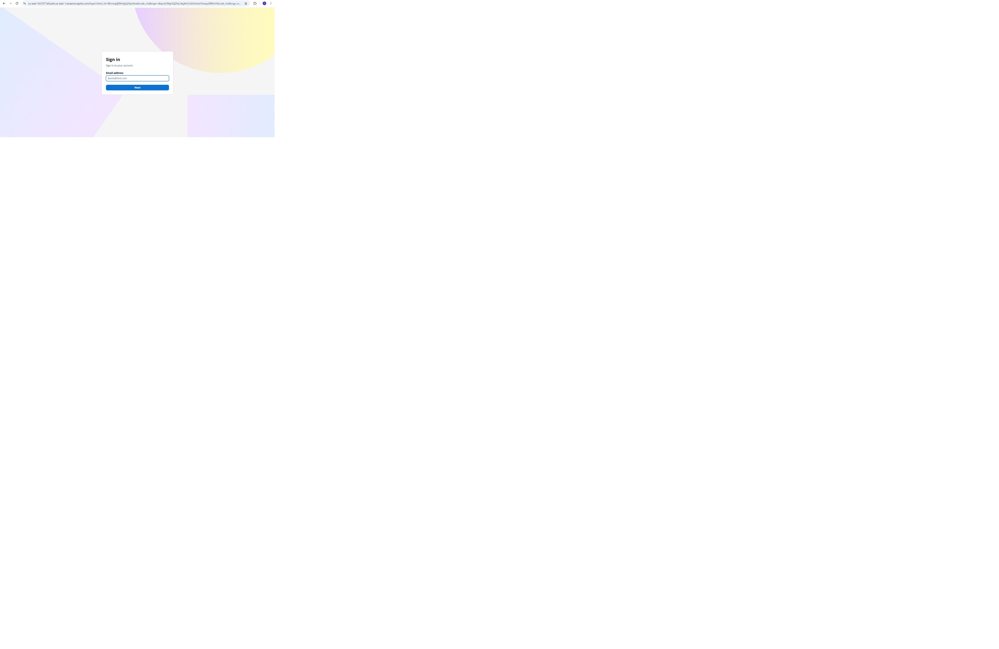
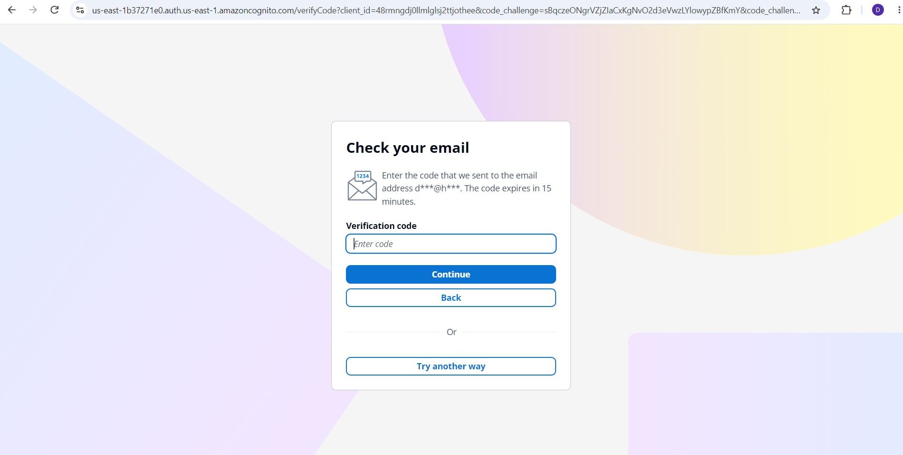
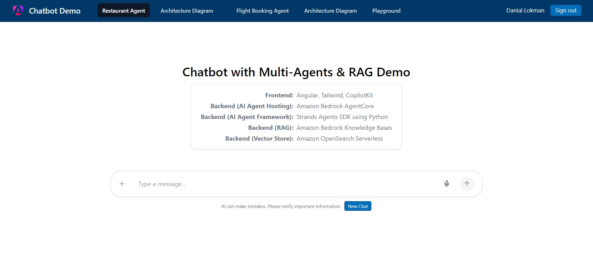
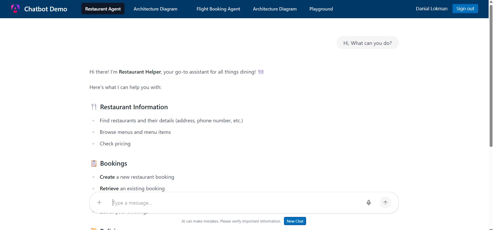
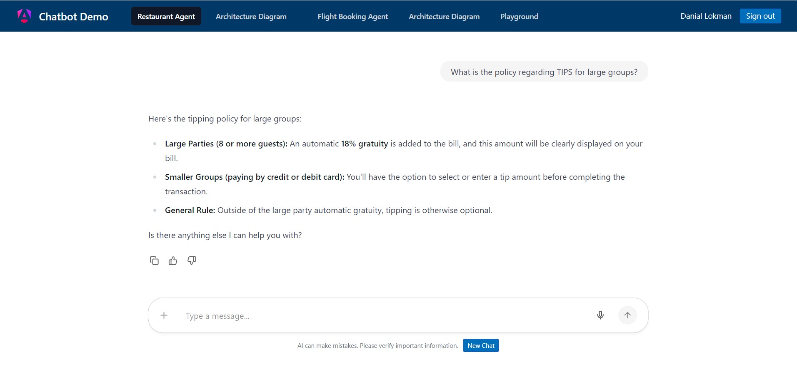
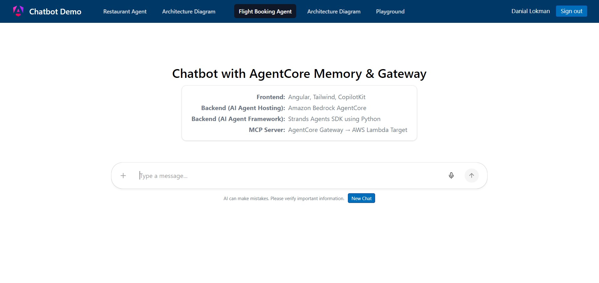
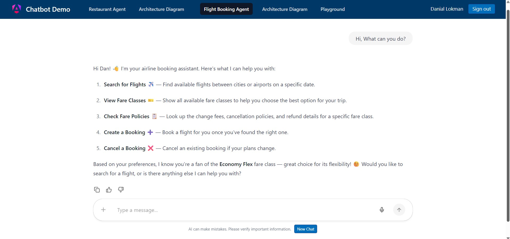
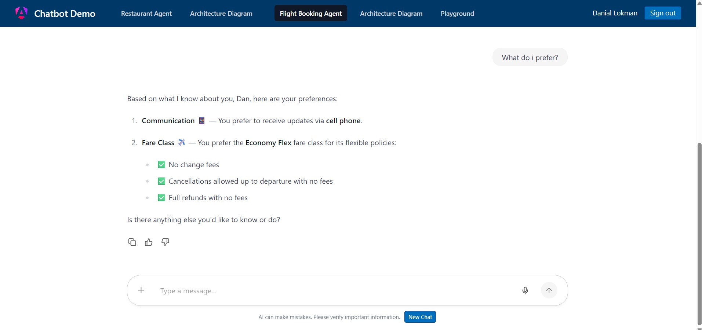
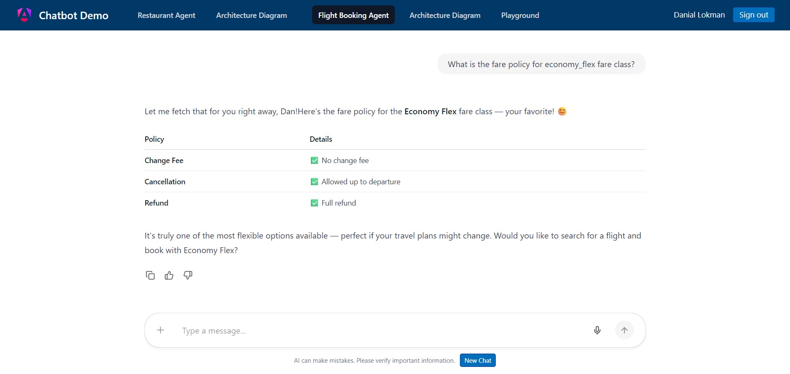
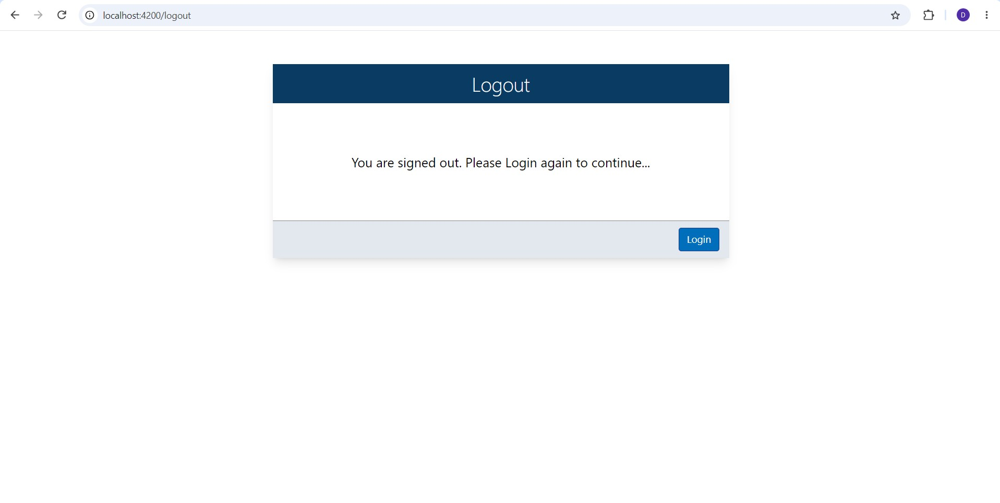

# 🧩Angular22project

## 🧰 Tech Stack
 - Angular 22, TailwindCSS, CopilotChatView (From Copilotkit), Angular Auth OIDC Client (For AWS Cognito)

## 🔐 Authentication
 - Angular frontend uses AWS Managed Login with Amazon Cognito, with authentication implemented using the angular-auth-oidc-client library.
 - Authenticates each end user using OAuth 2.0 / OpenID Connect (OIDC) with Cognito Authorization Code Flow + PKCE

## 🖥️ UI Snapshots of both RestaurantAgent & FlightBookingAgent Chatbots

### 1) Login UI on initial page load(Protected by AWS Cognito – Managed Login UI using OAuth 2.0 / OIDC)
<p align="left">
  
</p>

<p align="left">
  
</p>

### 2) Restaurant Agent Chabot UI (pointing to AgentCore Runtime Endpoint 1 to Demo Multi-Agents with RAG)

<p align="left">
  
</p>

<p align="left">
  
</p>

<p align="left">
  
</p>

### 3) Flight Booking Agent Chabot UI (pointing to AgentCore Runtime Endpoint 2 to Demo AgentCore Memory & AgentCore Gateway)

<p align="left">
  
</p>

<p align="left">
  
</p>

<p align="left">
  
</p>

<p align="left">
  
</p>

### 4) Clicking on Sign out logs you out

<p align="left">
  
</p>


## 📖 Command Reference
- npm run start
- ng serve
- ng serve --open (to open window)
- ng build  (will put build on dist folder)

1- Without Cognito
 - npx http-server .\dist\angular22project\browser to run it

2- With Cognito
 - npx serve -s .\dist\angular22project\browser -l 4200   (then load http://localhost:4200)

## 🌐 Development server

To start a local development server, run:

```bash
npm run start
```

Once the server is running, open your browser and navigate to `http://localhost:4200/`. The application will automatically reload whenever you modify any of the source files.

## 🧱 Code scaffolding

Angular CLI includes powerful code scaffolding tools. To generate a new component, run:

```bash
ng generate component component-name
```

For a complete list of available schematics (such as `components`, `directives`, or `pipes`), run:

```bash
ng generate --help
```

## 🛠️ Building

To build the project run:

```bash
ng build
```

This will compile your project and store the build artifacts in the `dist/` directory. By default, the production build optimizes your application for performance and speed.

## 🧪 Running unit tests

To execute unit tests with the [Vitest](https://vitest.dev/) test runner, use the following command:

```bash
ng test
```

## 🔄 Running end-to-end tests

For end-to-end (e2e) testing, run:

```bash
ng e2e
```

Angular CLI does not come with an end-to-end testing framework by default. You can choose one that suits your needs.

## 📚 Additional Resources

For more information on using the Angular CLI, including detailed command references, visit the [Angular CLI Overview and Command Reference](https://angular.dev/tools/cli) page.
